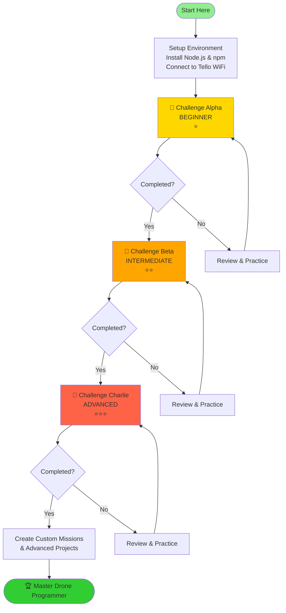
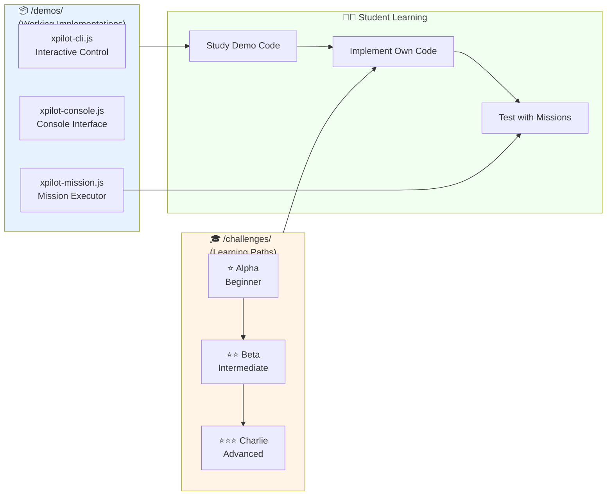
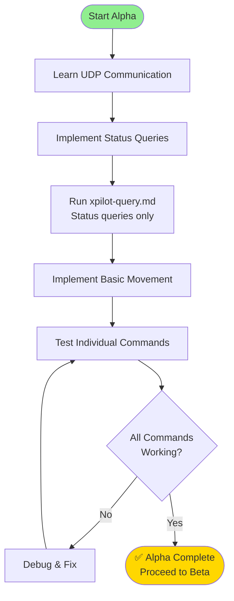
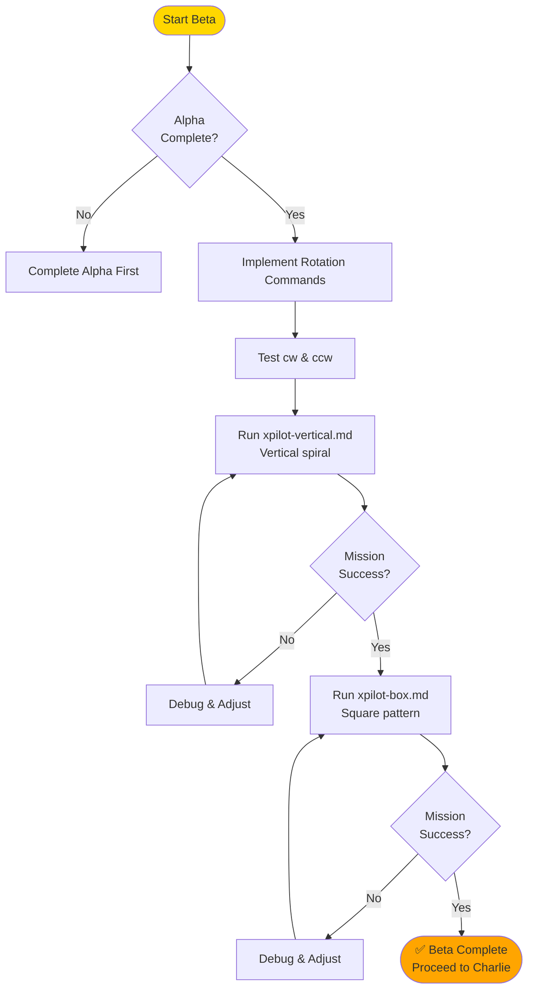
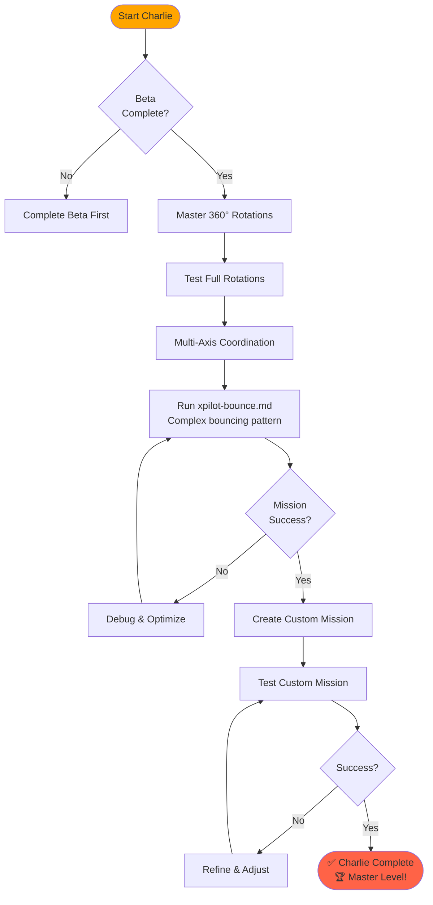
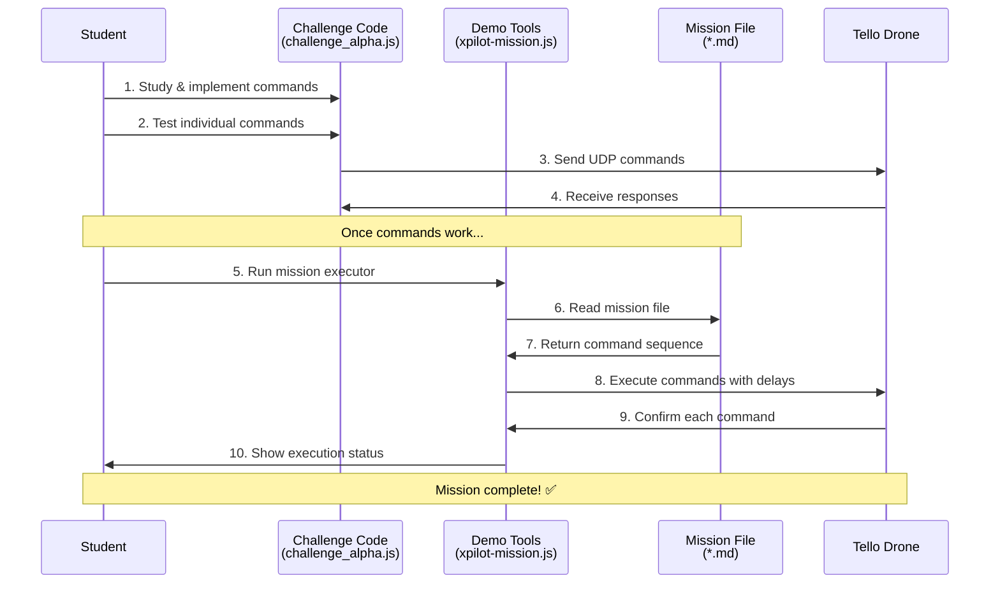
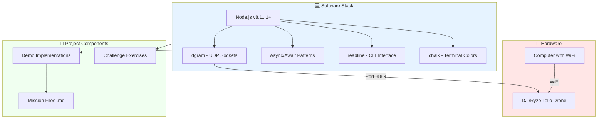
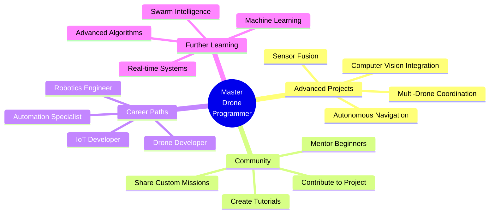

# X-PilotLab Roadmap

A visual guide to the X-PilotLab learning progression and project architecture.

## Learning Journey Overview

X-PilotLab is designed as a progressive learning system that takes you from beginner to advanced drone programming through hands-on challenges.

## Project Architecture

## Challenge Alpha - Beginner (⭐)

**Duration:** 1-2 hours | **Difficulty:** Easy | **Flight Risk:** Low

### What You'll Master - Alpha

- UDP socket communication
- Drone command structure
- Status queries: `command`, `battery?`, `speed?`, `time?`
- Basic movements: `takeoff`, `land`, `up`, `down`, `forward`, `backward`, `left`, `right`

### Alpha Mission

- **xpilot-query.md** - Safe status queries (no flight)

---

## Challenge Beta - Intermediate (⭐⭐)

**Duration:** 2-4 hours | **Difficulty:** Medium | **Flight Risk:** Medium

### What You'll Master - Beta

- Rotation commands: `cw <angle>`, `ccw <angle>`
- Command sequencing and timing
- Geometric flight patterns
- Multi-axis coordination

### Beta Missions

- **xpilot-vertical.md** - Vertical movements with rotation
- **xpilot-box.md** - Square pattern with 90° turns

---

## Challenge Charlie - Advanced (⭐⭐⭐)

**Duration:** 4+ hours | **Difficulty:** Hard | **Flight Risk:** High

### What You'll Master - Charlie

- Full 360° rotations
- Complex multi-axis maneuvers
- Bouncing/oscillating patterns
- Advanced timing and sequencing
- Custom mission creation

### Charlie Mission

- **xpilot-bounce.md** - Bouncing with full 360° spins

### Final Project

- Create your own custom mission file
- Design unique flight choreography
- Optimize command timing
- Share with the community

---

## Component Interaction Flow

## Technology Stack

## Skills Progression Matrix

| Skill | Alpha ⭐ | Beta ⭐⭐ | Charlie ⭐⭐⭐ |
| ------- | --------- | ---------- | -------------- |
| UDP Communication | ✅ Learn | ✅ Use | ✅ Master |
| Basic Commands | ✅ Implement | ✅ Use | ✅ Master |
| Status Queries | ✅ Implement | ✅ Use | ✅ Use |
| Rotation (90°) | ❌ | ✅ Implement | ✅ Use |
| Rotation (360°) | ❌ | ❌ | ✅ Implement |
| Command Sequencing | ❌ | ✅ Learn | ✅ Master |
| Multi-Axis Control | ❌ | ✅ Learn | ✅ Master |
| Pattern Design | ❌ | ✅ Learn | ✅ Master |
| Custom Missions | ❌ | ❌ | ✅ Create |
| Debugging | ✅ Basic | ✅ Intermediate | ✅ Advanced |
| Safety Protocols | ✅ Learn | ✅ Practice | ✅ Master |

## Time Investment

```mermaid
gantt
    title X-PilotLab Learning Timeline
    dateFormat X
    axisFormat %H:%M

    section Setup
    Environment Setup :done, setup, 0, 1h

    section Alpha
    Study Demo Code :done, alpha1, 0, 1h
    Implement Commands :active, alpha2, after alpha1, 1h
    Test & Debug :alpha3, after alpha2, 30min

    section Beta
    Implement Rotation :beta1, after alpha3, 1h
    Test Vertical Mission :beta2, after beta1, 1h
    Test Box Mission :beta3, after beta2, 1h
    Debug & Refine :beta4, after beta3, 1h

    section Charlie
    Master 360° Rotations :charlie1, after beta4, 2h
    Test Bounce Mission :charlie2, after charlie1, 1h
    Create Custom Mission :charlie3, after charlie2, 2h
    Optimize & Share :charlie4, after charlie3, 1h
```

**Total Time:** ~12-15 hours from beginner to master

## Safety Progression

```mermaid
graph LR
    subgraph Alpha["Alpha - Low Risk"]
        A1[Ground Testing]
        A2[Status Queries]
        A3[Supervised Flight]
    end

    subgraph Beta["Beta - Medium Risk"]
        B1[Controlled Patterns]
        B2[Rotation Practice]
        B3[Open Area Required]
    end

    subgraph Charlie["Charlie - High Risk"]
        C1[Complex Maneuvers]
        C2[Full Rotations]
        C3[Large Area Required]
    end

    A1 --> A2
    A2 --> A3
    A3 --> B1
    B1 --> B2
    B2 --> B3
    B3 --> C1
    C1 --> C2
    C2 --> C3

    style Alpha fill:#90EE90
    style Beta fill:#FFD700
    style Charlie fill:#FFA500
```

## Success Metrics

### Alpha ⭐

- [ ] UDP connection established
- [ ] All status queries working
- [ ] Basic movement commands implemented
- [ ] xpilot-query.md executed successfully
- [ ] Safe flight tested

### Beta ⭐⭐

- [ ] Rotation commands working
- [ ] xpilot-vertical.md completed autonomously
- [ ] xpilot-box.md completed autonomously
- [ ] Consistent flight patterns
- [ ] No manual intervention needed

### Charlie ⭐⭐⭐

- [ ] 360° rotations mastered
- [ ] xpilot-bounce.md completed autonomously
- [ ] Custom mission created
- [ ] Advanced debugging skills
- [ ] Ready to teach others

## Next Steps After Completion

---

## Quick Reference

**Project Structure:**

- `/demos/` - Working reference implementations
- `/challenges/alpha/` - Beginner challenge
- `/challenges/beta/` - Intermediate challenge
- `/challenges/charlie/` - Advanced challenge

**Progression:** Alpha → Beta → Charlie → Custom Missions → Master

**Support:** Check `/README.md` for detailed setup and navigation instructions

**Safety:** Always prioritize safety, monitor battery, fly in open areas

---

**Ready to start your drone programming journey? Begin with [Challenge Alpha](challenges/alpha/README.md)!**
